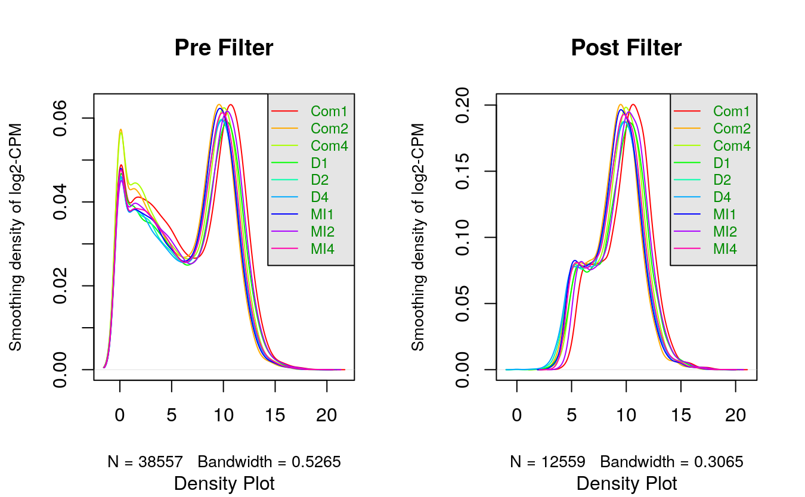
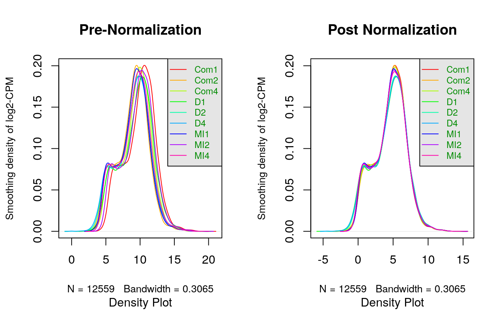
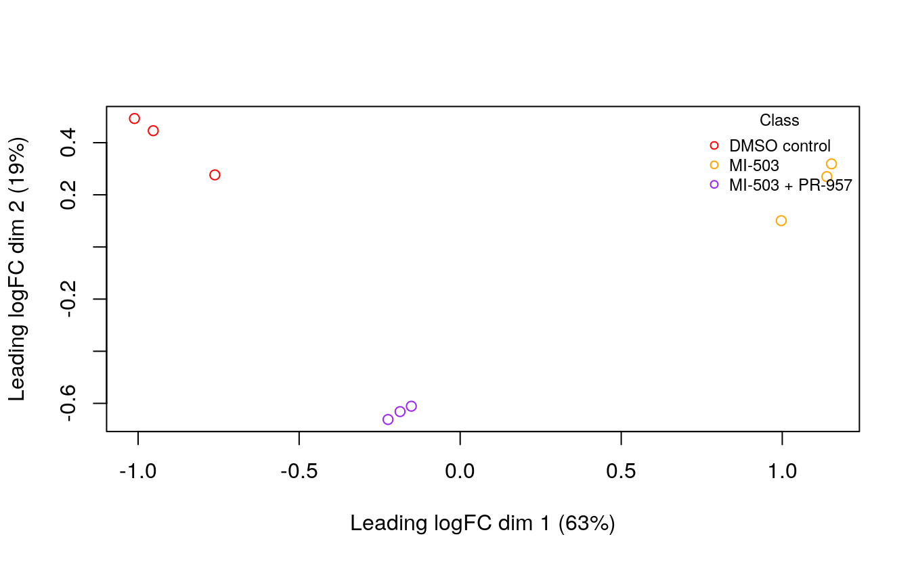
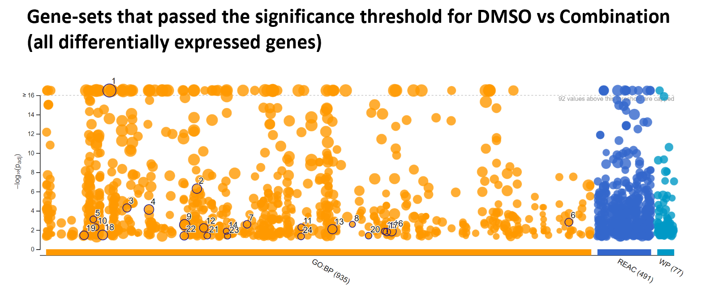
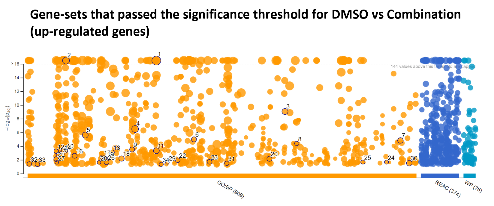

# 1 Differential Gene Expression

#### Include necessary packages
```{r echo=FALSE, message=FALSE, warning=FALSE}
if (!require("BiocManager", quietly = TRUE)){
    install.packages("BiocManager")
}

library(knitr)
library(edgeR)

importObj <- list("import/filtered_data_matrix.Rda",
                  "import/normalized_counts.Rda",
                  "import/rnaseq_df_HGNC.Rda",
                  "import/samples_info_dt.Rda")
for (item in importObj){load(item)}
```

## 1.1 Summary of my Dataset

__IMPORTANT DISCLAIMER__: For this assignment, I was initially working with the filtered and normalized datasets from A1. However, it came to my attention that 2 of the samples (MI-503 Replicate #3 and DMSO Replicate #3) were not grouped properly in the MDS plot (figure below). I subsequently performed DGE analysis on the data and looked at the heatmap (figures below). It was especially evident in DMSO vs Combination where I noticed DMSO Replicate #3 incorrectly grouped with the Combinations samples. I checked my initial datasets and procedures conducted in A1 and find no errors. Thus, I suspect there might be mislabeling of the samples. With the advice of Professor Isserlin, I removed them as I re-do the filtering, normalization and DGE analysis. 


&nbsp;
***

{width=48%} {width=48%}

&nbsp;

__Updated Summary__: 

* Dataset GEO ID: "GSE225356
* Number of samples: 9 (11 before removal)
  + Control: 3 DMSO (4 before removal)
  + Treatment1: 3 MI-503 (Menin Inhibitor) (4 before removal)
  + Treatment2: 3 Combination (MI503 + Pr-957)
* Number of genes:
  + Initial RNASeq dataframe: 38557
  + Post-filtering & Normalization: 12511 (12666 before removal)
* Variables in my dataset: `r colnames(samples_info_dt)`

Genes with low count were filtered out from the data. Then, I normalize the dataset via _calcNormFactors()_ and _cpm()_. After removing the problematic samples, I re-do the BCV plot and Mean-Variance plot. They have similar curves to the ones performed in A1.

The following figure shows the difference in my dataset pre- and post-filtering.


&nbsp;
&nbsp;

The following figure shows the difference in my dataset pre- and post-normalization.


&nbsp;
&nbsp;

## 1.2  Conducting Differential Expression Analysis via edgeR

#### Model Design
I first need to consider which factor(s) to include in my model. Considering that all variables besides _Treatment_ are uniform across the samples, I will have to design the model with _Treatment_.

The MDS plot generated in Assignment 1 is shown below. There is great separation between the groups (DMSO vs MI-503 vs Combination). As a reminder, the 2 problematic samples are removed.

Since _Treatment_ has 3 groups, I will split the dataset to do two 2-group comparisons:
* Comparison 1: DMSO vs MI-503
* Comparison 2: DMSO vs Combination (MI-503 + PR-957)

```{r warning=FALSE, message=FALSE}
# Create design matrix for Comparison 1 (DMSO vs MI-503)
treatment1 = samples_info_dt$Treatment[-c(7:9)]
model_design1 <- model.matrix(~treatment1)
model_design1[1:5,]

# Create design matrix for Comparison 2 (DMSO vs Combination)
treatment2 = samples_info_dt$Treatment[-c(4:6)]
model_design2 <- model.matrix(~treatment2)
model_design2[1:5,]
```

#### Construct the model
```{r warning=FALSE, message=FALSE}
# create DGElist object for Comparison 1 and Comparison 2
d1 = DGEList(counts=filtered_data_matrix[,-c(1:3)], group=treatment1)
d2 = DGEList(counts=filtered_data_matrix[,-c(7:9)], group=treatment2)

# calculate normalization factors
d1 = calcNormFactors(d1)
d2 = calcNormFactors(d2)

# estimate dispersion with our model design
d1 <- estimateDisp(d1, model_design1)
d2 <- estimateDisp(d2, model_design2)

# fit the model
fit1 <- glmQLFit(d1, model_design1)
fit2 <- glmQLFit(d2, model_design2)

# calculate differential expression using Quasi Likelihood model
qlf.DMSO_vs_MI503 <- glmQLFTest(fit1, coef='treatment1MI-503')
qlf.DMSO_vs_Combination <- glmQLFTest(fit2, coef='treatment2MI-503 + PR-957')

# Table of the top differentially expressed genes
kable(topTags(qlf.DMSO_vs_MI503), type="html", row.names = TRUE)
kable(topTags(qlf.DMSO_vs_Combination), type="html", row.names = TRUE)
```

&nbsp;
&nbsp;

## 1.3 DGE Analysis
For both Comparison 1 and Comparsion 2, we want to determine how many genes pass the threshold p-value of 0.05 and pass the correction. 

```{r warning=FALSE, message=FALSE}
# Get the results for both comparisons
qlf_outputHits1 <- topTags(qlf.DMSO_vs_MI503,
                           sort.by = "PValue",
                           adjust.method = "BH",
                           n = nrow(normalized_counts))

qlf_outputHits2 <- topTags(qlf.DMSO_vs_Combination,
                           sort.by = "PValue",
                           adjust.method = "BH",
                           n = nrow(normalized_counts))

# Number of genes that pass threshold p-val of < .05
num_passThreshold1 <- length(which(qlf_outputHits1$table$PValue < 0.05))
num_passThreshold2 <- length(which(qlf_outputHits2$table$PValue < 0.05))

# Number of genes that pass B-Hcorrection
num_passCorrection1 <- length(which(qlf_outputHits1$table$FDR < 0.05))
num_passCorrection2 <- length(which(qlf_outputHits2$table$FDR < 0.05))
```

Comparison Group    |  # of genes that have p-val < .05 | # of genes that pass B-H correction
------------------- | --------------------------------- | --------------------
DMSO vs MI-503      | `r num_passThreshold1`            | `r num_passCorrection1`
DMSO vs Combination | `r num_passThreshold2`            | `r num_passCorrection2`

It appears that there are more genes that are differentially expressed in _DMSO vs Combination_ than _DMSO vs MI-503_, controlling for the false discovery rate via B-H correction.

&nbsp;
&nbsp;

#### Heatmap Visualization
Comparison 1: DMSO vs MI-503
```{r warning=FALSE, message=FALSE}
library(grid)
library(ComplexHeatmap)
library(circlize)

# Heatmap matrix for DMSO vs MI-503
heatmap_matrix1 <- normalized_counts[,-c(1:3)]

#row-normalization
heatmap_matrix1 <- t(scale(t(heatmap_matrix1)))

rownames(heatmap_matrix1) <- rownames(normalized_counts)
colnames(heatmap_matrix1) <- colnames(normalized_counts[,-c(1:3)])

# subsetting the heatmap matrix to only include top hits
top_hits1 <- rownames(qlf_outputHits1$table)[qlf_outputHits1$table$PValue < 0.05]

heatmap_matrix_tophits1 <- t(scale(t(heatmap_matrix1[which(rownames(heatmap_matrix1) %in% top_hits1),])))

if(min(heatmap_matrix_tophits1) == 0){
  heatmap_col1 = colorRamp2(c(0, max(heatmap_matrix_tophits1)),
                              c("white", "red"))
} else {
  heatmap_col1 = colorRamp2(c(min(heatmap_matrix_tophits1), 0, max(heatmap_matrix_tophits1)), 
                            c("blue", "white", "red"))
}

# Annotations to visualize data clusters
unique_treatment <- unique(samples_info_dt$Treatment)
unique_treatment_col <- rainbow(n = length(unique_treatment))
names(unique_treatment_col) <- unique_treatment

ha1 <- HeatmapAnnotation(df = data.frame(treatment_type = treatment1),
  col = list(treatment_type = unique_treatment_col),
  show_legend = TRUE
)

# Actual heatmap for DMSO vs MI-503.
current_heatmap1 <- Heatmap(as.matrix(heatmap_matrix1), top_annotation = ha1,
                            cluster_rows = TRUE, cluster_columns = TRUE,
                            show_row_dend = TRUE, show_column_dend = TRUE, 
                            col = heatmap_col1, show_heatmap_legend = TRUE,
                            show_row_names = FALSE, show_column_names = FALSE,
                            column_title = "Top hits DMSO vs MI-503"
                            )
```

&nbsp;
&nbsp;

Comparison 2: DMSO vs Combination (MI-503 + PR-957)
```{r warning=FALSE, message=FALSE}
# Heatmap matrix for DMSO vs Combination
heatmap_matrix2 <- normalized_counts[,-c(7:9)]

#row-normalization
heatmap_matrix2 <- t(scale(t(heatmap_matrix2)))

rownames(heatmap_matrix2) <- rownames(normalized_counts)
colnames(heatmap_matrix2) <- colnames(normalized_counts[,-c(7:9)])

# subsetting the heatmap matrix to only include top hits
top_hits2 <- rownames(qlf_outputHits2$table)[qlf_outputHits2$table$PValue < 0.05]

heatmap_matrix_tophits2 <- t(scale(t(heatmap_matrix2[which(rownames(heatmap_matrix2) %in% top_hits2),])))

if(min(heatmap_matrix_tophits2) == 0){
  heatmap_col2 = colorRamp2(c(0, max(heatmap_matrix_tophits2)),
                              c("white", "red"))
} else {
  heatmap_col2 = colorRamp2(c(min(heatmap_matrix_tophits2), 0, max(heatmap_matrix_tophits2)), 
                            c("blue", "white", "red"))
}

# Annotations to visualize data clusters
unique_treatment <- unique(samples_info_dt$Treatment)
unique_treatment_col <- rainbow(n = length(unique_treatment))
names(unique_treatment_col) <- unique_treatment

ha2 <- HeatmapAnnotation(df = data.frame(treatment_type = treatment2),
  col = list(treatment_type = unique_treatment_col),
  show_legend = TRUE
)

# Actual heatmap for DMSO vs Combination
current_heatmap2 <- Heatmap(as.matrix(heatmap_matrix2), top_annotation = ha2,
                            cluster_rows = TRUE, cluster_columns = TRUE,
                            show_row_dend = TRUE, show_column_dend = TRUE, 
                            col = heatmap_col1, show_heatmap_legend = TRUE,
                            show_row_names = FALSE, show_column_names = FALSE,
                            column_title = "Top hits DMSO vs Combination"
                            )
```

{width=48%} {width=48%}

The Heatmap shows that the groups are clustered properly based on treatment_type, and there are clear clustering of genes that up-regulate and down-regulated together.

&nbsp;
&nbsp;
&nbsp;
&nbsp;

***

&nbsp;
&nbsp;
&nbsp;
&nbsp;


# 2 Thresholded ORA

## 2.2 Analyzing Changes in Gene Expression between Treatment Groups
```{r warning=FALSE, message=FALSE}
# Significant fold-changes genes in DMSO vs MI-503 DGE
up_comparison1 <- length(which(qlf_outputHits1$table$PValue < 0.05 &
                                 qlf_outputHits1$table$logFC > 0))

down_comparison1 <- length(which(qlf_outputHits1$table$PValue < 0.05 &
                                   qlf_outputHits1$table$logFC < 0))

# Significant fold-changes genes in DMSO vs Combination DGE
up_comparison2 <- length(which(qlf_outputHits2$table$PValue < 0.05 &
                                 qlf_outputHits2$table$logFC > 0))

down_comparison2 <- length(which(qlf_outputHits2$table$PValue < 0.05 &
                                   qlf_outputHits2$table$logFC < 0))
```

Comparison Group    | Upregulated Genes Count | Downregulated Genes Count 
------------------- | ----------------------- | -------------------------
DMSO vs MI-503      | `r up_comparison1`      | `r down_comparison1`
DMSO vs Combination | `r up_comparison2`      | `r down_comparison2`

&nbsp;
&nbsp;


## 2.3 Construct Thresholded List of Genes

```{r warning=FALSE, echo=FALSE}
# create filtered data matrix with Gene symbols
filtered_data_matrix_HGNC <- data.frame(filtered_data_matrix)
symbol1 <- c()
gene1 <- c()

# retrieve hgnc_symbols
for (i in seq(dim(filtered_data_matrix_HGNC)[1])){
  symbol1 <- c(symbol1, rnaseq_df_HGNC$hgnc_symbol[
    which(rownames(filtered_data_matrix_HGNC)[i] == rnaseq_df_HGNC$Gene )])
}

# retrieve gene names
for (i in seq(dim(filtered_data_matrix_HGNC)[1])){
  gene1 <- c(gene1, rnaseq_df_HGNC$Gene[
    which(rownames(filtered_data_matrix_HGNC)[i] == rnaseq_df_HGNC$Gene )])
}
filtered_data_matrix_HGNC["hgnc_symbol"] <- symbol1
filtered_data_matrix_HGNC["gene"] <- gene1
filtered_data_matrix_HGNC <- filtered_data_matrix_HGNC[,c(11,10,1:9)]
```

```{r warning=FALSE, message=FALSE}
# DMSO vs MI-503
# merge top hits with gene names
qlf_outputHits1_HGNC <- merge(filtered_data_matrix_HGNC[,1:2],
                              qlf_outputHits1, by.x=1, by.y=0) 
# remove genes that don't have HGNC symbols
qlf_outputHits1_HGNC <- 
  qlf_outputHits1_HGNC[which(!is.na(qlf_outputHits1_HGNC$hgnc_symbol)),]

upreg_genes1 <- qlf_outputHits1_HGNC$hgnc_symbol[
  which(qlf_outputHits1_HGNC$PValue < 0.05 &
          qlf_outputHits1_HGNC$logFC > 0)]

downreg_genes1 <- qlf_outputHits1_HGNC$hgnc_symbol[
  which(qlf_outputHits1_HGNC$PValue < 0.05 &
          qlf_outputHits1_HGNC$logFC < 0)]

write.table(x = upreg_genes1,
            file = file.path(getwd(), "DMSOvMI-503_upregulated_genes.txt"),
            sep = "\t", row.names = FALSE,
            col.names = FALSE, quote = FALSE)

write.table(x = downreg_genes1,
            file = file.path(getwd(), "DMSOvMI-503_downregulated_genes.txt"),
            sep = "\t", row.names = FALSE,
            col.names = FALSE, quote = FALSE)
```

```{r warning=FALSE, message=FALSE}
# DMSO vs Combination
# merge top hits with gene names
qlf_outputHits2_HGNC <- merge(filtered_data_matrix_HGNC[,1:2],
                              qlf_outputHits2, by.x=1, by.y=0) 
# remove genes that don't have HGNC symbols
qlf_outputHits2_HGNC <- 
  qlf_outputHits2_HGNC[which(!is.na(qlf_outputHits2_HGNC$hgnc_symbol)),]

upreg_genes2 <- qlf_outputHits2_HGNC$hgnc_symbol[
  which(qlf_outputHits2_HGNC$PValue < 0.05 &
          qlf_outputHits2_HGNC$logFC > 0)]

downreg_genes2 <- qlf_outputHits2_HGNC$hgnc_symbol[
  which(qlf_outputHits2_HGNC$PValue < 0.05 &
          qlf_outputHits2_HGNC$logFC < 0)]

# save themm to txt file
write.table(x = upreg_genes2,
            file = file.path(getwd(), "DMSOvCombination_upregulated_genes.txt"),
            sep = "\t", row.names = FALSE,
            col.names = FALSE, quote = FALSE)

write.table(x = downreg_genes2,
            file = file.path(getwd(), "DMSOvCombination_downregulated_genes.txt"),
            sep = "\t", row.names = FALSE,
            col.names = FALSE, quote = FALSE)
```

&nbsp;
&nbsp;


## 2.4 Thresholded Over-Representation Analysis via G:Profiler
While I will be doing ORA via G:Profiler for both comparisons, I will be doing a deeper analysis on DMSO vs Combination, since that's the Treatment of Interest in the associated article [@pmc_10694946]. I have also adjusted the term-size to be between 3 and 250 so that the list contains larger interpretative value. I used both versions of G:Profiler (Web and R).

1. Method chosen: G:Profiler
2. Annotation data: GO:Biological Pathway, Reactome, WikiPathways (current versions)
3. Number of genesets returned: 1503 for DMSO v Combination (figure below)

ORA for DMSO vs MI-503
```{r message=FALSE, warning=FALSE}
library(gprofiler2)
# ORA for both up-regulated and down-regulated genes
gprofiler_results_both1 <- gost(query = c(upreg_genes1, downreg_genes1),
                                 significant=FALSE,
                                 ordered_query = FALSE,
                                 exclude_iea=TRUE,
                                 correction_method = "fdr",
                                 organism = "hsapiens",
                                 source = c("REAC","WP","GO:BP"))

# ORA for up-regulated genes subset
gprofiler_results_upreg1 <- gost(query = upreg_genes1,
                                 significant=FALSE,
                                 ordered_query = FALSE,
                                 exclude_iea=TRUE,
                                 correction_method = "fdr",
                                 organism = "hsapiens",
                                 source = c("REAC","WP","GO:BP"))

# ORA for down-regulated genes subset
gprofiler_results_downreg1 <- gost(query = downreg_genes1,
                                 significant=FALSE,
                                 ordered_query = FALSE,
                                 exclude_iea=TRUE,
                                 correction_method = "fdr",
                                 organism = "hsapiens",
                                 source = c("REAC","WP","GO:BP"))

kable(gprofiler_results_both1$result[1:4,], type="html", row.names = TRUE,
      caption = "Query Result for DMSO vs MI-503 (All Differentially Expressed Genes)")

kable(gprofiler_results_upreg1$result[1:4,], type="html", row.names = TRUE,
      caption = "Query Result for DMSO vs MI-503 (Up-Regulated Genes)")

kable(gprofiler_results_downreg1$result[1:4,], type="html", row.names = TRUE,
      caption = "Query Result for DMSO vs MI-503 (Down-Regulated Genes)")
```

&nbsp;
&nbsp;

ORA for DMSO vs Combination
```{r message=FALSE, warning=FALSE}
gprofiler_results_both2 <- gost(query = c(upreg_genes2, downreg_genes2),
                                 significant=FALSE,
                                 ordered_query = FALSE,
                                 exclude_iea=TRUE,
                                 correction_method = "fdr",
                                 organism = "hsapiens",
                                 source = c("REAC","WP","GO:BP"))

# ORA for up-regulated genes subset
gprofiler_results_upreg2 <- gost(query = upreg_genes2,
                                 significant=FALSE,
                                 ordered_query = FALSE,
                                 exclude_iea=TRUE,
                                 correction_method = "fdr",
                                 organism = "hsapiens",
                                 source = c("REAC","WP","GO:BP"))

# ORA for down-regulated genes subset
gprofiler_results_downreg2 <- gost(query = downreg_genes2,
                                 significant=FALSE,
                                 ordered_query = FALSE,
                                 exclude_iea=TRUE,
                                 correction_method = "fdr",
                                 organism = "hsapiens",
                                 source = c("REAC","WP","GO:BP"))

kable(gprofiler_results_both2$result[1:4,], type="html", row.names = TRUE,
      caption = "Query Result for DMSO vs Combination (All Differentially Expressed Genes)")

kable(gprofiler_results_upreg2$result[1:4,], type="html", row.names = TRUE,
      caption = "Query Result for DMSO vs Combination (Up-Regulated Genes)")

kable(gprofiler_results_downreg2$result[1:4,], type="html", row.names = TRUE,
      caption = "Query Result for DMSO vs Combination (Down-Regulated Genes)")
```

Figure illustrating gene-sets that pass threshold using different queries: all DEG vs up-regulated genes vs down-regulated genes
{width=50%}
{width=48%} {width=48%}

As expected, a huge portion of the gene-sets come from GO annotation.
The top most significantly-enriched terms for DMSO vs Combination are of the following:

1. Using all DEG as query:
  * GO:BP
    + DNA replication
    + sister chromatid segregation
    + mitochondrial gene expression
  * Reactome
    + Mitotic Metaphase and Anaphase
    + Mitotic Anaphase
    + S Phase
  * WikiPathways
    + Retinoblastoma gene in cancer
    + mRNA processing
    + DNA repair pathways full network
2. Using Up-regulated genes as query:
  * GO:BP
    + mitochondrial gene expression
    + mitochondrial translation
    + rRNA metabolic process
  * Reactome
    + mRNA Splicing
    + mRNA Splicing - Major Pathway
    + Mitochondrial translation elongation
  * WikiPathways
    + Retinoblastoma gene in cancer
    + mRNA processing
    + Cell cycle
3. Using Down-regulated genes as query:
  * GO:BP
    + vacuole organization
    + vacuolar transport
    + lysosomal transport
  * Reactome
    + Nuclear events mediated by NFE2L2
    + KEAP1-NFE2L2 pathway
    + Antigen processing-Cross presentation
  * WikiPathways
    + TYROBP causal network in microglia
    + Proteasome degradation
    + Degradation pathway of sphingolipids including diseases

&nbsp;
&nbsp;
&nbsp;
&nbsp;

***

&nbsp;
&nbsp;
&nbsp;
&nbsp;


# 3 Interpretations and Conclusions

1. Do the over-representation results support conclusions or mechanism discussed in the original paper?
The over-representation results do support the conclusions discussed in the original paper [@pmc_10694946], to a certain degree. Based on the key terms in the ORA for DMSO vs Combination, the DEGs and up-regulated genes share some common pathways and GO terms, which are related to the gene expression pathway and cell cycle. These are expected since the article [@pmc_10694946] is looking for gene targets that reduce the proliferation of AML (cancer). Interestingly, the down-regulated genes have terms that are more different from the DEGs and up-regulated genes. Proteasome degradation term was enriched in WikiPathways, which supports the article that reduction in proteasome helps reduce proliferation of AML.

2. Can you find evidence, i.e. publications, to support some of the results that you see. How does this evidence support your results.
BASP1 is up-regulated in my DEG Analysis. This is supported by other publications [@zhou2018methylation], which confirms that the silencing of BASP1 leads to  leukemogenesis in AML. Thus, the treatment of Pr-957+MI-503 up-regulates the BASP1 gene expression, which in turn reduces the proliferation of AML.

__Conclusions__

On my initial workflow, I noticed issues with the MDS plot, heatmap clustering, and number of differentially expressed genes. I make the decision to remove the problematic samples per the advice of Professor Isserlin, and re-do filtering and normalization. In this assignment, I have successfully conducted differential gene expression analysis via EdgeR, as well as preliminary thresholded over-representation analysis via G:Profiler.


&nbsp;
&nbsp;
&nbsp;
&nbsp;

***

&nbsp;
&nbsp;
&nbsp;
&nbsp;    

