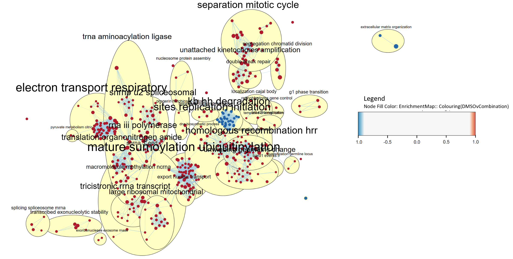
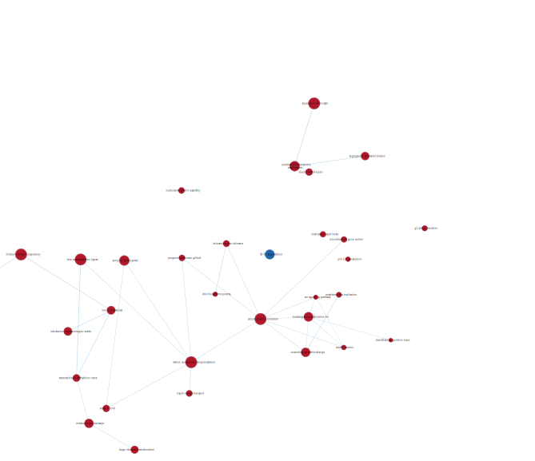

#### Include necessary packages and data object
```{r required_packages, message=FALSE, warning=FALSE}
# Check if Biocondutor is installed
if (!requireNamespace("BiocManager", quietly = TRUE))
    install.packages("BiocManager")

# Install knitr
if (!requireNamespace("knitr", quietly = TRUE))
    install.packages("knitr")

if (!requireNamespace("GEOquery", quietly = TRUE))
    BiocManager::install("GEOquery")


# Install edgeR
if (!requireNamespace("edgeR", quietly = TRUE))
    BiocManager::install("edgeR")

# Install gprofiler2
if (!requireNamespace("gprofiler2", quietly = TRUE))
    BiocManager::install("gprofiler2")

# Install RCy3
if (!requireNamespace("RCy3", quietly = TRUE))
    BiocManager::install("RCy3")

importObj <- list("import/filtered_data_matrix.Rda",
                  "import/normalized_counts.Rda",
                  "import/rnaseq_df_HGNC.Rda",
                  "import/samples_info_dt.Rda")
for (item in importObj){load(item)}

library(knitr)
library(RCy3)
```

```{r GSEA_executable, eval=TRUE, warning=FALSE, message=FALSE, results="hide"}
executables <- paste0(getwd(), "/executables")
unzip_gsea <- function() {
    # Unzip the GSEA zip file
    unzip(
        zipfile = file.path(executables, "GSEA_4.3.3.zip"),
        exdir = executables
    )
    
    # Define the path to the GSEA executable
    gsea_executable <- file.path(executables, "GSEA_4.3.3", "gsea-cli.sh")

    # Make the GSEA executable file executable (i.e., chmod +x)
    system(paste("chmod +x", shQuote(gsea_executable)))

    # Return the path to the GSEA executable
    return(gsea_executable)
}

# Check if GSEA folder already exists in the downloads directory
if (!dir.exists(file.path(executables, "GSEA_4.3.3"))) {
    # Call the function to download and unzip GSEA if necessary
    gsea_executable <- unzip_gsea()
} else {
    # Define the path to the GSEA executable
    gsea_executable <- file.path(executables, "GSEA_4.3.3", "gsea-cli.sh")
}
```

&nbsp;
&nbsp;

# Summary

The paper associated with my dataset, _Immunoproteasome function maintains oncogenic gene expression in KMT2A-complex driven leukemia_, investigates novel therapeutic strategies for KMT2A-rearranged acute myeloid leukemia (KMT2A-r AML) [pmc_10694946]. Current treatments involves pharmacologic targeting of chromatin-associated protein complexes. However, drug resistance remains one of the biggest issue with this treatment. The paper has identified the catalytic immunoproteasome subunit PSMB8 as a specific vulnerability in KMT2A-r AML. Targeting it enhances efficacy of Menin-inhibitors, suggesting a potential therapeutic strategy for this subtype of AML. 

__IMPORTANT DISCLAIMER__: I was initially working with the filtered and normalized datasets from A1. However, it came to my attention that 2 of the samples (MI-503 Replicate #3 and DMSO Replicate #3) were not grouped properly in the MDS plot (figure below). I subsequently performed DGE analysis on the data and looked at the heatmap (figures below). It was especially evident in DMSO vs Combination where I noticed DMSO Replicate #3 incorrectly grouped with the Combinations samples. I checked my initial datasets and procedures conducted in A1 and find no errors. Thus, I suspect there might be mislabeling of the samples. With the advice of Professor Isserlin, I removed them as I re-do the filtering, normalization and DGE analysis. 

The following figures show the problematic MDS plot and Heatmap Clustering [@complexheatmap_2022], [@circlize_2022]:

{width=48%} {width=48%}

__Updated Overview__: 

* Dataset GEO ID: "GSE225356
* Organism: Homo sapiens
* Number of samples: 9 (11 before removal)
  + Control: 3 DMSO (4 before removal)
  + Treatment1: 3 MI-503 (Menin Inhibitor) (4 before removal)
  + Treatment2: 3 Combination (MI503 + Pr-957)
* Number of genes:
  + Initial RNASeq dataframe: 38557
  + Post-filtering & Normalization: 12511 (12666 before removal)
* Variables in my dataset: `r colnames(samples_info_dt)`


&nbsp;
&nbsp;

## Data Cleaning and Normalization

Genes with low counts, as well as duplicate gene rows, were filtered out from the data. Then, I normalize the dataset via trimmed mean of m-values (TMM). After removing the problematic samples, I re-do the BCV plot and Mean-Variance plot. They have similar curves to the ones performed in A1.

The following figure shows the difference in my dataset pre- and post-filtering.


The following figure shows the difference in my dataset pre- and post-normalization. This is done via edgeR [@edgeR_2022]


&nbsp;
&nbsp;

## Differential Gene Expression Analysis
I perform DGE Analysis for 2 comparison groups: _DMSO vs MI-503_ and _DMSO vs Combination_. This analysis is performed by fitting a quasi-likelihood negative binomial GLM to the gene expression dataset using `edgeR` package in R. FDR was performed via B-H correction to correct for multiple hypothesis testing, with alpha threshold set to `0.05`. The number of genes that passed the test are presented below and the results are visualized in the following MA-plots for both comparisons. 
  
Comparison Group    |  # of genes that have p-val < .05 | # of genes that pass B-H correction
------------------- | --------------------------------- | --------------------
DMSO vs MI-503      | 7824                              | 7300
DMSO vs Combination | 8298                              | 7800
  


## Thresholded Enrichment Analysis (Over-representation Analysis)

__IMPORTANT DISCLAIMER__: Hereafter, my analysis will be focused on _DMSO vs Combination_, since that is the treatment of interest in the associated article [@pmc_10694946]. G:Profiler was configured to perform multiple testing correction by applying FDR and excluding electronic annotations. Pathway sources used include REAC, WP and GO:BP. ORA is done for the up-regulated gene set,down-regulated gene set and all differentially expressed gene set. 

Based on the key terms in the ORA for DMSO vs Combination, the DEGs and up-regulated genes share some common pathways and GO terms, which are related to the gene expression pathway and cell cycle. These are expected since the article (Tubı́o-Santamarı́a et al. 2023) is looking for gene targets that reduce the proliferation of AML (cancer). Interestingly, the down-regulated genes have terms that are more different from the DEGs and up-regulated genes. Proteasome degradation term was enriched in WikiPathways, which supports the article that reduction in proteasome helps reduce proliferation of AML.

&nbsp;
&nbsp;

***

&nbsp;
&nbsp;

# Non-thresholded Gene Set Enrichment Analysis (GSEA)

> 1. What method did you use? What genesets did you use? Make sure to specify versions and cite your methods.

In order to perform GSEA, we will need to create a rank file using this equation:  
$$\text{Rank} = -\log_{10}(p) \times \text{sign}(logFC)$$
where $p$ is the p-value of the gene and $logFC$ is the log fold change of the gene. We will using the gene set `Human_GOBP_AllPathways_noPFOCR_no_GO_iea_March_01_2024_symbol.gmt` from Bader Lab, which excludes electronically inferred annotations (EIA) and pathway figure optical character recognition (PFOCR). This gene set is last updated on March 1, 2024. The Analysis will be conducted via GSEA CLI, version 4.3.3.

#### Creating rank file
```{r warning=FALSE, message=FALSE}

load("qlf_outputHits2_HGNC.rda")
# Create a data frame to store the ranks
rownames(qlf_outputHits2_HGNC) <- qlf_outputHits2_HGNC$gene
rank_df <- data.frame(
    GeneName = rownames(qlf_outputHits2_HGNC),
    Rank = -log10(qlf_outputHits2_HGNC$PValue) * sign(qlf_outputHits2_HGNC$logFC)
)

# Save the ranks to a file
rank_file <- file.path("DMSO_vs_Combination_rank.rnk")
write.table(rank_df, rank_file, sep = "\t", row.names = FALSE, quote = FALSE)
```

```{r GSEA_prep, eval=FALSE, message=FALSE, warnin=FALSE}
library(RCurl)
# Name the GSEA analysis
gsea_analysis_name <- "DMSO_vs_Combination"

# GSEA Output directory
gsea_output_dir <- file.path(".", "gsea_output")

# Define the input rank file
rank_file <- file.path(".", "DMSO_vs_Combination_rank.rnk")

download_gmt_file <- function(species) {
  # URL to bader lab's gene set
  URL <- "https://download.baderlab.org/EM_Genesets/March_01_2024/Human/symbol/Human_GO_AllPathways_noPFOCR_no_GO_iea_March_01_2024_symbol.gmt"
  gmt_file <- "Human_GO_AllPathways_noPFOCR_no_GO_iea_March_01_2024_symbol.gmt"
  # Download the file
  download.file(
      url = URL,
      destfile = file.path(gmt_file)
  ) 
  # Return the name of the downloaded file
  return(gmt_file)
}


# Download the gene set file
gmt_file <- file.path(download_gmt_file("Human"))


# Define the GSEA command
command <- sprintf(
    "%s GSEAPreRanked -gmx %s -rnk %s -collapse false -nperm 1000 -scoring_scheme weighted -rpt_label %s -plot_top_x 20 -rnd_seed 12345 -set_max 200 -set_min 15 -zip_report false -out %s > gsea_output.txt",
    shQuote(gsea_executable),
    shQuote(gmt_file),
    shQuote(rank_file),
    shQuote(gsea_analysis_name),
    shQuote(gsea_output_dir)
)
```

Now, running GSEA.
```{r eval=FALSE, message=FALSE, warning=FALSE}
# Check if results already exist
gsea_result_folder <- list.files(gsea_output_dir)
if (length(gsea_result_folder) == 0) {
    # Run the GSEA command
    system(command)
}

# Get a list of the TSV files in the GSEA results directory
gsea_files <- list.files(paste(gsea_output_dir, gsea_result_folder, sep = "/"))
gsea_files <- gsea_files[grep(".tsv", gsea_files)]
```


#### GSEA Results
```{r warning=FALSE, message=FALSE}
# Get a list of the TSV files in the GSEA results directory
gsea_output_dir <- file.path("gsea_output")
gsea_result_folder <- file.path("DMSO_vs_Combination.GseaPreranked.1712414521489")

gsea_files <- list.files(paste(gsea_output_dir, gsea_result_folder, sep = "/"))
gsea_files <- gsea_files[grep(".tsv", gsea_files)]

# Find the overall reports of the GSEA
rx <- gregexpr("gsea_report_for_.*\\.tsv", gsea_files)
gsea_report_files <- gsea_files[unlist(rx) > 0]
na_pos_file <- gsea_report_files[grep("na_pos", gsea_report_files)]
na_neg_file <- gsea_report_files[grep("na_neg", gsea_report_files)]

# Load the GSEA results (.tsv) into a data frame
na_pos_report <- read.delim(
    file.path(gsea_output_dir, gsea_result_folder, na_pos_file),
    sep = "\t"
)
na_neg_report <- read.delim(
    file.path(gsea_output_dir, gsea_result_folder, na_neg_file),
    sep = "\t"
)

# Number of upregulated gene sets for both conditions
num_upreg_pos <- nrow(na_pos_report)
num_upreg_neg <- nrow(na_neg_report)
total_genesets <- num_upreg_pos + num_upreg_neg

# Number of gene sets with FDR < 5%
num_upreg_pos_fdr <- sum(na_pos_report$FDR < 0.05)
num_upreg_neg_fdr <- sum(na_neg_report$FDR < 0.05)

# Number of gene sets with pvalue < 1%
#num_upreg_pos_pval <- sum(na_pos_report$NOM.p.val < 0.01)
#num_upreg_neg_pval <- sum(na_neg_report$NOM.p.val < 0.01)

# Number of gene sets with pvalue < 5%
num_upreg_pos_pval_5 <- sum(na_pos_report$NOM.p.val < 0.05)
num_upreg_neg_pval_5 <- sum(na_neg_report$NOM.p.val < 0.05)
```

## Enrichment Results

> 2. Summarize your enrichment results.

Parameters used to run this GSEA Analysis:
* only gene sets that has 15 to 200 genes are considered

Out of the 4411 gene sets considered, there are 2882 gene sets that that were enriched corresponding to genes that have increased expression change when comparing Combination to DMSO. When controlling for FDR < 0.05, 1240 gene sets are considered enriched.

In contrast, there are 3189 gene sets that were enriched corresponding to genes that have decreased expression change when comparing Combination to DMSO. When controlling for FDR < 0.05, 544 gene sets are considered enriched (considerably less).

I have presented the top 5 enriched gene sets in Combination treatment and DMSO treatment, respectively.

```{r warning=FALSE, message=FALSE}
# Create a data frame to store the summary
gsea_summary <- data.frame(
    Condition = c("Combination", "DMSO"),
    NumGeneSets = c(num_upreg_pos, num_upreg_neg),
    NumGeneSetsFDR = c(num_upreg_pos_fdr, num_upreg_neg_fdr),
    NumGeneSetsPVal5 = c(num_upreg_pos_pval_5, num_upreg_neg_pval_5)
)

# Update the column names
colnames(gsea_summary) <- c("Condition", "Total Gene Sets", "Gene Sets (FDR < 5%)", "Gene Sets (p-value < 5%)")

# Display the summary
knitr::kable(
    gsea_summary,
    caption = "Summary of the GSEA results for DMSO vs Combination (MI-503 + PR-957)"
)
```

Top 5 enriched gene sets in Combination Treatment vs DMSO Treatment
```{r warning=FALSE, message=FALSE}
table_cols <- c("NAME", "ES", "NES", "FDR.q.val", "LEADING.EDGE")
kable(
  na_pos_report[1:5, table_cols],
  type = "html",
  caption = 
    "Table 1. Top 5 NES GSEA Enriched Gene Sets expressed in Combination Treatment"
)
```
```{r warning=FALSE, message=FALSE}
kable(
  na_neg_report[1:5, table_cols],
  type = "html",
  caption = 
    "Table 1. Top 5 NES GSEA Enriched Gene Sets expressed in DMSO Treatment"
)
```

> 3. How do these results compare to the results from the thresholded analysis in Assignment #2. Compare qualitatively. Is this a straight forward comparison? Why or why not?

As a refresher, below are the signficantly-enriched terms found in the G:Profiler result for DMSO vs Combination.  

1. Using Up-regulated genes as query:
  * GO:BP
    + mitochondrial gene expression
    + mitochondrial translation
    + rRNA metabolic process
  * Reactome
    + mRNA Splicing
    + mRNA Splicing - Major Pathway
    + Mitochondrial translation elongation
  * WikiPathways
    + Retinoblastoma gene in cancer
    + mRNA processing
    + Cell cycle
2. Using Down-regulated genes as query:
  * GO:BP
    + vacuole organization
    + vacuolar transport
    + lysosomal transport
  * Reactome
    + Nuclear events mediated by NFE2L2
    + KEAP1-NFE2L2 pathway
    + Antigen processing-Cross presentation
  * WikiPathways
    + TYROBP causal network in microglia
    + Proteasome degradation
    + Degradation pathway of sphingolipids including diseases


Comparing the results of ORA and GSEA isn't exactly straightforward. The input for ORA is the significant genes  (up-regulated and down-regulated) after the differential expression analysis. The purpose is to identify whether a particular gene set is overrepresented in a list of genes. On the other hand, the input for GSEA is all the genes that have been ranked. The purpose is to determine whether a gene set shows significant differences between 2 states (Combination vs DMSO). GSEA results will be ranked by the normalized enrichment score while G:Profiler will be ordered by the adjusted p-value. Thus, results may be similar but ranked completely differently. We shouldn't compare the results directly.

That being said, the results share similar themes.The GSEA positive ranked enriched gene sets and the positive fold change G:Profiler results involves common themes like gene expression regulation, such as Myc [@salvatori2011], and cell cycle checkpoint. On the other hand, the GSEA negative ranked enriched gene sets and the negative fold change G:Profiler results involves common themes like proteasome degradation. While the gene sets are not necessarily 1 to 1, these results matches the findings of the article associated with the dataset.


&nbsp;
&nbsp;

***

&nbsp;
&nbsp;

# Visualizing Gene Set Enrichment Results Using Cytoscape


#### Setting up Cytoscape
```{r eval=FALSE, warning=FALSE, message=FALSE}
# Connect to Cytoscape
cyrest_url <- "http://localhost:1234/v1"
cytoscapePing(cyrest_url)
cytoscapeVersionInfo(cyrest_url)
```

#### Installing required apps in Cytoscape
```{r eval=FALSE, warning=FALSE, message=FALSE}
apps <- c("enrichmentmap", "autoannotate")
installed_apps <- RCy3::getInstalledApps(base.url = cyrest_url)
new_apps <- c()
for (app in apps){
  RCy3::installApp(app, base.url = cyrest_url)
  new_apps <- c(new_apps, app)
}

```
#### Uploading Data to Cytoscape
```{r eval=FALSE, warning=FALSE, message=FALSE}
enrichment_results <- file.path(
    gsea_output_dir, gsea_result_folder, "edb", "results.edb")
write.table(normalized_counts, file="normalized_counts.txt", sep = "\t", 
            quote=FALSE)
write.table(normalized_counts_Combination_vs_DMSO,
            file="normalized_counts_Combination_vs_DMSO.txt", sep="\t",
            quote=FALSE)
expression_data <- file.path("normalized_counts.txt")
upload_data_to_cytoscape <- function(cyrest_url, files) {
    # Store the uploaded file paths
    uploaded_paths <- c()

    for (file in files) {
        # Build the POST request
        bname <- basename(file)
        r <- httr::POST(
            url = paste0(
                cyrest_url, "/enrichmentmap/textfileupload?fileName=", bname
            ),
            config = list(),
            body = list(file = httr::upload_file(file)),
            encode = "multipart",
            handle = NULL
        )

        # Check if the upload was successful
        uploaded_paths <- c(uploaded_paths, httr::content(r, "parsed")$path)
    }

    return(uploaded_paths)
}

# Upload the required files to Cytoscape
em_files <- c(gmt_file, enrichment_results, expression_data, rank_file)
uploaded_files <- upload_data_to_cytoscape("http://localhost:1234", em_files)

# Store the host file paths
gmt_file_host <- uploaded_files[1]
enrichment_results_host <- uploaded_files[2]
expression_data_host <- uploaded_files[3]
rank_file_host <- uploaded_files[4]
```

#### Enrichment Map Threshold Setup

```{r eval=TRUE, warning=FALSE, message=FALSE}
# Define Analysis Name
em_analysis_name <- "Combination_vs_DMSO"

# Define the p-value threshold
pvalue_gsea_threshold <- 1.0

# Define the q-value threshold
qvalue_gsea_threshold <- 0.05

# Define the similarity threshold
similarity_threshold <- "0.375"

# Output the thresholds
knitr::kable(
    data.frame(
        PValue = pvalue_gsea_threshold,
        QValue = qvalue_gsea_threshold,
        Similarity = similarity_threshold
    ),
    caption = "Thresholds used for the Enrichment Map analysis."
)

#similarity metric to filter all the genesets connections/edges 
# (can be OVERLAP, JACCARD, or COMBINED)
similarity_metric = "COMBINED"
```


## Create Enrichment Map
```{r eval=FALSE, message=FALSE, warning=FALSE}
# Function to create an enrichment map using the provided cyrest_url
#
# Args:
#   cur_model_name: The name of the current model
#   pvalue_gsea_threshold: The p-value threshold for the GSEA analysis
#   qvalue_gsea_threshold: The q-value threshold for the GSEA analysis
#   similarity_threshold: The similarity threshold for the enrichment map
#   similarity_metric: The similarity metric for the enrichment map
#   gsea_ranks_file: The file containing the GSEA ranks
#   gsea_results_filename: The file containing the GSEA results
#   expression_file_fullpath: The full path to the expression data file
#   gmt_gsea_file: The file containing the GSEA gene sets
#   current_base: The base URL of the Cytoscape REST API
#
# Returns:
#   The response from the Cytoscape REST API
create_enrichment_map <- function(
    cur_model_name, pvalue_gsea_threshold, qvalue_gsea_threshold,
    similarity_threshold, similarity_metric, gsea_ranks_file,
    gsea_results_filename, expression_file_fullpath, gmt_gsea_file,
    current_base
) {
    # Construct the network name
    current_network_name <- paste(
        cur_model_name,
        pvalue_gsea_threshold,
        qvalue_gsea_threshold,
        sep = "_"
    )

    # Construct the EM command
    em_command <- paste(
        'enrichmentmap build analysisType="gsea"',
        "gmtFile=", gmt_gsea_file,
        "pvalue=", pvalue_gsea_threshold,
        "qvalue=", qvalue_gsea_threshold,
        "similaritycutoff=", similarity_threshold,
        "coefficients=", similarity_metric,
        "ranksDataset1=", gsea_ranks_file,
        "enrichmentsDataset1=", gsea_results_filename,
        "filterByExpressions=false",
        "expressionDataset1=", expression_file_fullpath,
        "gmtFile=", gmt_gsea_file,
        sep = " "
    )

    # Execute the EM command
    response <- RCy3::commandsGET(em_command, base.url = current_base)

    # Initialize network SUID
    current_network_suid <- 0

    # Check if the command execution failed
    if (grepl(pattern = "Failed", response)) {
        return(paste(response))
    } else {
        current_network_suid <- response
    }

    # Check if the network name is unique
    current_names <- RCy3::getNetworkList(base.url = current_base)

    # If the name already exists, prepend the SUID to the name
    if (current_network_name %in% current_names) {
        current_network_name <- paste(
            current_network_suid,
            current_network_name,
            sep = "_"
        )
    }

    # Rename the network
    response <- RCy3::renameNetwork(
        title = current_network_name,
        network = as.numeric(current_network_suid),
        base.url = current_base
    )

    return(response)
}

# 1. Initial EM (p = 1.0, q = 0.05)
em_response <- create_enrichment_map(
    em_analysis_name, pvalue_gsea_threshold, qvalue_gsea_threshold,
    similarity_threshold, similarity_metric, rank_file_host,
    enrichment_results_host, expression_data_host, gmt_file_host,
    cyrest_url
)
em_response_suid <- em_response$network
```

> 1. Create an enrichment map - how many nodes and how many edges in the resulting map? What thresholds were used to create this map? Make sure to record all thresholds. Include a screenshot of your network prior to manual layout.


_Unmodified initial enrichment map_:  

* This enrichment map is created using q-value threshold of 0.001 (initially used q-value threshold of 0.05, but the map was too big). The edges that represented the similarity had a default threshold of 0.375, using the combined Jaccard and Overlap similarity metric.
* There are 1785 nodes and 15578 edges in this enrichment map, which is larger than I initially expected.

This enrichment map was created using Cytoscape app _EnrichmentMap_ [@merico2010enrichment].


## Network annotation
```{r eval=FALSE, warning=FALSE, message=FALSE}
# Function to annotate the current enrichment map using the provided cyrest_url
#
# Args:
#   current_base: The base URL of the Cytoscape REST API
#
# Returns:
#   The response from the Cytoscape REST API
annotate_enrichment_map <- function(current_base) {
    # Annotate the network
    response <- RCy3::commandsGET(
        paste(
            "autoannotate annotate-clusterBoosted",
            "network=current",
            sep = " "
        ),
        base.url = current_base
    )

    return(response)
}

# Function to summarize the current enrichment map using the provided cyrest_url
#
# Args:
#   current_base: The base URL of the Cytoscape REST API
#
# Returns:
#   The response from the Cytoscape REST API
summarize_enrichment_map <- function(current_base) {
    # Annotate the network
    response <- RCy3::commandsGET(
        paste(
            "autoannotate summary",
            "network=current",
            sep = " "
        ),
        base.url = current_base
    )

    return(response)
}

# Annotate and summarize the initial network
annotated_network <- annotate_enrichment_map(cyrest_url)

# export_enrichment_map(
#     cyrest_url,
#     paste0(em_analysis_name, "_annotated_network.png"),
#     em_output_dir
# )

annotated_network <- summarize_enrichment_map(cyrest_url)
annotated_network <- annotate_enrichment_map(cyrest_url)

# export_enrichment_map(
#     cyrest_url,
#     paste0(em_analysis_name, "_annotated_theme_network.svg"),
#     em_output_dir
# )
```


> 2. Annotate your network - what parameters did you use to annotate the network. If you are using the default parameters make sure to list them as well.


This annotated network is created via Cytoscape App _AutoAnnotate_ [@kucera2016autoannotate], which provides automatic pathway processes grouping.

The parameters are listed below (all default values):

* Cluster Algorithm: MCL Cluster
* Edge Weight Column: similarity coefficient
* Label Column: GS_DESCR
* Label Algorithm: WordCloud: Adjacent Words
* Maximum words per label: 3
* Minimum word occurence: 1
* Adjacent word bonus: 8
* No additional words were excluded
* No additional delimiters were specified


> 3. Make a publication ready figure - include this figure with proper legends in your notebook.



__Publication Ready Enrichment Map__:   

* Each node represents a gene set.
* The size of a node represents the size of the gene set it represents.
* Edges represents the existence of similarity between the nodes, and hence, the gene sets they represent.
* The color of the nodes represent a positive log fold change if it’s red and blue for a negative log fold change. Red nodes indicate relative increased expression in Combination samples while blue nodes represent relative increased expression in DMSO samples.


> 4. Collapse your network to a theme network. What are the major themes present in this analysis? Do they fit with the model? Are there any novel pathways or themes?



The major themes present in this analysis involve gene expression pathway and DNA repair pathway, as some of the key pathway nodes include sites replication initiation, mature sumoylation ubiquitinylation (which is involved in post-translation modification), and homologous recombination (which is involved in DNA repair). Meanwhile, the only major theme present in the DMSO treatment  (blue node) is the kb hh degradation, which is involved in protein degradation via proteasome.

These themes fit with the model studied in the associated article. In the paper, the authors discovered that Combination (PR-957 + MI-503) treatment inactivates immunoproteasome subunit PSMB8, which in turn increases transcription factor BASP1. This means that there are increase in gene expression. There are some novel pathways/ themes that were not discussed in the paper, such as electron transport respiratory and macromolecule methylation ncrna. Electron transport respiratory is one of the targets for treatment of AML [@carter2020], while ncrna methylation is believed to be cancer hallmark in leukemia [@zhou2018methylation]. 


&nbsp;
&nbsp;

***

&nbsp;
&nbsp;


# Interpretation and Detailed View of the Results

## Interpretations
> 1. Do the enrichment results support conclusions or mechanism discussed in the original paper? How do these results differ from the results you got from Assignment #2 thresholded methods

In general, the enrichment results from GSEA and ORA do indeed support the mechanisms discussed in the original paper. In the control treatment, the protein degradation pathway are significantly enriched. The authors of the original paper describe the immunoproteasome subunit PSMB8 as responsible for the proliferation of KMT2r-AML. The Combination (PR957+MI503) treatment inactivates this immunoproteasome subunit and increases transcription factor BASP1. This is supported by the gene expression pathways (transcription, translations, and post-translation) being significantly enriched in GSEA.  

Due to difference in methodology between GSEA and ORA, the significance levels of different gene sets varied vastly. Furthermore, it seems that the GSEA approach, i.e., enrichment analysis without thresholding, resulted in a broader set of genesets covering a variety of gene sets that may not have necessarily passed the threshold.

&nbsp;
&nbsp;

> 2. Can you find evidence, i.e. publications, to support some of the results that you see. How does this evidence support your result?

E2F is a transcription factor considered to be a cancer hallmark for AML. Patients with AML usually have irregular E2F levels, as E2f regulates the expression of a number of genes important in cell proliferation, as well as DNA damage repair and development. Thus, an irregular E2f levels may result in uncontrolled cell proliferation, which is a distinct feature of cancer. With the Combination treatment, E2F gene set is significantly enriched, which suggest that this gene may be a potential therapeutic target. Though this transcription factor isn't really discussed in the article, another article [@feng2020] investigates and support this result.  

Gene sets involving proteasome complex and regulation are significantly enriched in the GSEA result expressed in DMSO treatment. This is discussed in both the original paper and supported by another article [@antony2021]. Without the PR957+MI503 treatment, the proteasomes are not inhibited. The proteasomes degrade the Menin inhibitors, which were supposed to inhibit the proliferation of leukemic cells. This effectively reduces the efficacy of previous AML drugs that target menin as the AML cells can self-renew and proliferate.

&nbsp;
&nbsp;

## Post Analysis

> Add a post analysis to your main network using specific transcription factors, microRNAs or drugs. Include the reason why you chose the specific miRs, TFs or drugs (i.e publications indicating that they might be related to your model). What does this post analysis show?


This post-analysis was created using the Cytoscape App `EnrichmentApp`. I added `Human_DrugBank_approved_symbol.gmt` as the input file for potential signature gene sets. This file is downloaded from Bader Lab. Only the gene sets that pass the the Mann-Whitney Test (Two-Sided) cutoff of 0.01 were selected (18 total).  

These drugs were used for my post-analysis because I wanted to explore the drugs whose gene sets are significantly enriched in my data. Finding these drugs may help provide potential candidates for KMT2A-r AML treatment.  

Two particular results caught my attention. NADPH pathway is significantly enriched. This is supported in an article titled _NADPH metabolism determines the leukemogenic capacity and drug resistance of AML cells_ [@chen2022]. NADH/NADPH is involve in the redox metabolism. The authors discover that NADPH homeostasis regulation is crucial in determining leukemogenic capacity and drug resistance in AML patients. This is also supported in my GSEA results, where pathways related to `Mitchondrial Gene Expression` is significantly enriched.

In addition, Fostamatinib is also significantly enriched in the post-analysis enrichment map. This is supported in an articel titled _SYK inhibition targets acute myeloid leukemia stem cells by blocking their oxidative metabolism_ [@polak2020].  Fostamatinib is a small-molecule SKY inhibitor. It targets leukemia stem cells by blocking their oxidative metabolism, thus presents itself as a potential drug target. However, there are not many researches that have been done on using Fostamatinib as drug treatment for AML yet.


&nbsp;
&nbsp;
&nbsp;
&nbsp;

***

&nbsp;
&nbsp;
&nbsp;
&nbsp;


